<a name="readme-top"></a>

<div align="center">
    ## Hub MegaPeliculas

    Este proyecto fue generado con Angular CLI versión 18.1.0
</div>


<details>
    <summary>Tabla de contenido</summary>

    - [Descripcion del proyecto](#descripcion-del-proyecto)
    - [Objetivos](#objetivos)
    - [Programas utilizados](#programas-utilizados)
    - [Instrucciones para descargar y ejecutar](#instrucciones-para-descargar-y-ejecutar)
    - [Descripcion del como se hizo](#descripcion-del-como-se-hizo)
    - [Diagrama Entidad-Relacion](#diagrama-entidad-relacion)
    - [Posibles mejoras futuras](#posibles-mejoras-futuras)
    - [Sprint review](#sprint-review)
    - [Imagenes de testing](#imagenes-de-testing)
    - [Documentacion de la API](#documentacion-de-la-api)
    - [Contribuyentes al proyecto](#contribuyentes-al-proyecto)

</details>

# Descripcion del proyecto

El presente trabajo, realizado en colaboración con un equipo de compañeros, expone el desarrollo completo de un Hub de Películas, desde su desarrollo inicial hasta su implementación final. Este hub fue desarrollado utilizando una API en ASP.NET con C# como lenguaje principal, y los datos se gestionaron a través de una base de datos en SQL Server. Se realizaron pruebas exhaustivas mediante Swagger para garantizar la correcta funcionalidad y la estabilidad del sistema. Este proyecto fue creado desde sus cimientos, permitiendo un enfoque integral en cada etapa del desarrollo, lo que permitió asegurar una implementación robusta y eficiente.

# Objetivos
* Implementar un proyecto productivo con Kubernetes.
* Mejorar el Hub de películas.  
* Normalización de la BD.
* Realizar una Api con ASP .net o Net core.
* Aplicación de Docker.

  # Para el Backend y el Frontend
* Se coloca el backend que fue trabajado en equipo y colocamos el link de Hub ya que es demasiado pesado.
https://github.com/AldairOrtiz-Kanako/Back_Peliculas_2.0.git
* Para el Frontend aquí está el link de la colaboración.
https://github.com/AldairOrtiz-Kanako/Hub_Peliculas_2.0.git

# Programas utilizados
* Angular 18
* Tailwind CSS
* C# Asp.net
* SQL Server
* JWT
* Swagger

# Instrucciones para descargar y ejecutar

### Angular
El primer paso, y el más importante, es clonar el repositorio remoto para ejecutarlo localmente.

```
git clone [URL del repositorio]
```

A continuación, el siguiente paso será instalar las dependencias y módulos necesarios para que el proyecto funcione correctamente.

```
npm install o npm i
```

Para ejecutar la funcionalidad principal del programa, deberás ejecutar el siguiente comando en la terminal:

```
ng serve --open
```

### ASP.NET
Como primer paso es clonar el repositorio.

```
git clone [URL del repositorio]
```

# Descripcion del cómo se hizo

1. Planificación Inicial: El proyecto comenzó con una sesión de brainstorming en la que se acordaron las características esenciales del Hub de Películas. Se definieron las funciones clave y se dividió el trabajo entre los miembros del equipo para maximizar la eficiencia y cumplir con los plazos establecidos.
2. Diseño y Desarrollo de la Base de Datos: Se diseñó una base de datos en SQL Server que incluyó stored procedures para optimizar el rendimiento y asegurar la integridad de los datos. También se implementó una función de hashing para las contraseñas de los usuarios, garantizando así la seguridad de la información almacenada. La base de datos fue normalizada para evitar redundancias y asegurar la consistencia de los datos.
3. Se desarrolló el backend utilizando C# con .NET Core. Para asegurar su correcto funcionamiento, se añadieron las credenciales, módulos y controladores necesarios. Posteriormente, se realizaron pruebas en Swagger, las cuales confirmaron que todo operaba de manera satisfactoria.
4. Se trabajó en el frontend utilizando Angular, mejorando los componentes y realizando ajustes para optimizar la experiencia visual. Además, se estableció la conexión con la API, lo que permitió visualizar los archivos almacenados en la base de datos. Por otro lado, se implementaron funciones en el módulo de inicio de sesión y registro para garantizar la seguridad de los datos ingresados. Se verificó también que las funciones implementadas guardaran correctamente la información en la base de datos.
5. Se realizaron pruebas (testing) en el proyecto de Angular, lo que nos permitió mejorar los resultados.
6. En el uso de Docker, se implementaron todos los requisitos necesarios para construir las imágenes; sin embargo, no se logró cumplir completamente con los objetivos previstos.
7. No se pudo implementar el uso de Kubernetes.

# Diagrama Entidad-Relación

Relaciones:
- Usuarios -> Favoritos: Relación uno a muchos. Un usuario puede tener múltiples favoritos.
- Películas -> Favoritos: Relación uno a muchos. Una película puede estar en la lista de favoritos de varios usuarios.
- Series -> Favoritos: Relación uno a muchos. Una serie puede estar en la lista de favoritos de varios usuarios.
- Películas -> Director: Relación muchos a uno. Una película tiene un director, pero un director puede tener varias películas.
- Series -> Director: Relación muchos a uno. Una serie tiene un director, pero un director puede dirigir varias series.
- Películas -> Género: Relación muchos a uno. Una película pertenece a un género, pero un género puede aplicarse a varias películas.
- Series -> Género: Relación muchos a uno. Una serie pertenece a un género, pero un género puede aplicarse a varias series.

Este modelo es útil para una aplicación que maneja información sobre películas y series, permitiendo a los usuarios agregar contenido a su lista de favoritos, y categorizando dicho contenido por género y director.

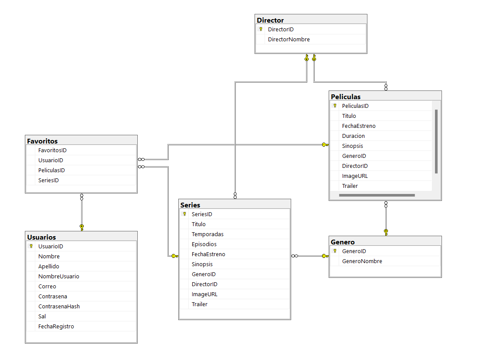

# Creacion de la BD
Se hizo la creaci´pon de la base de datos y los funcionamientos de SP.
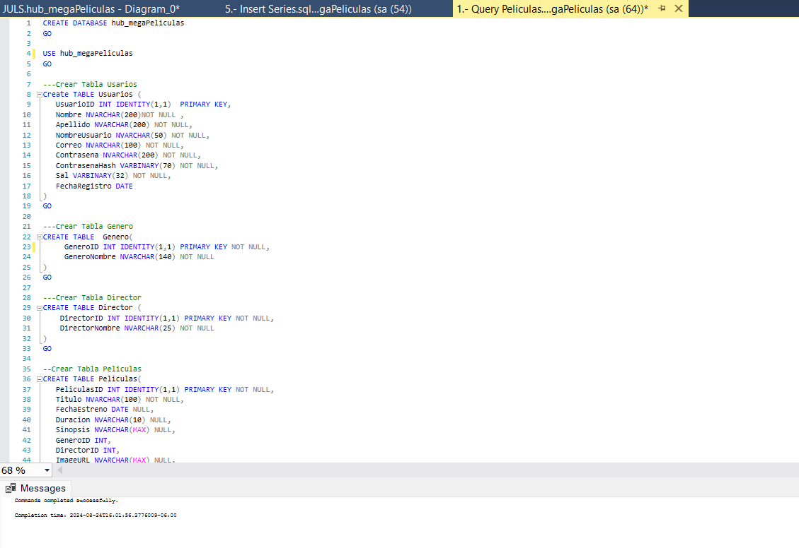

# Funcionamiento de Swagger
 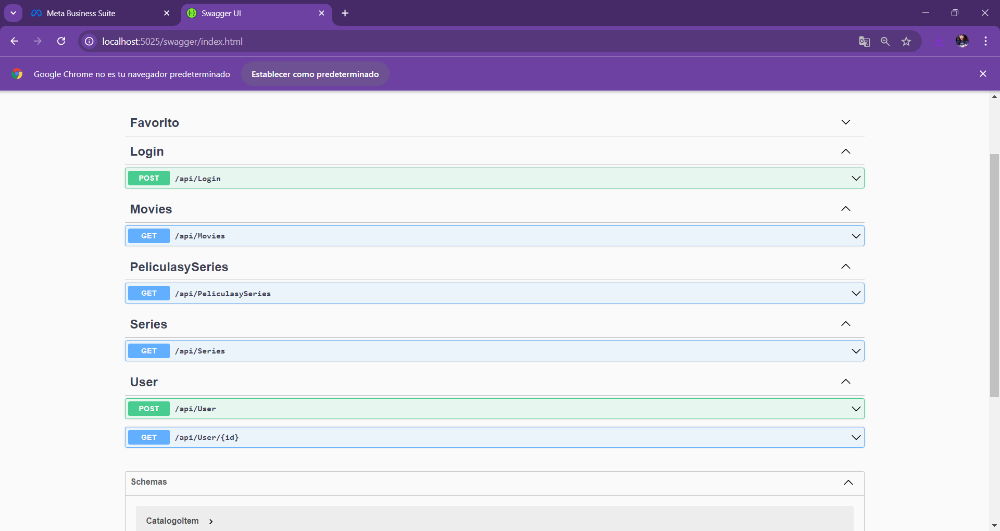

 Podemos ver que la conexión de la base de datos funcionaba.
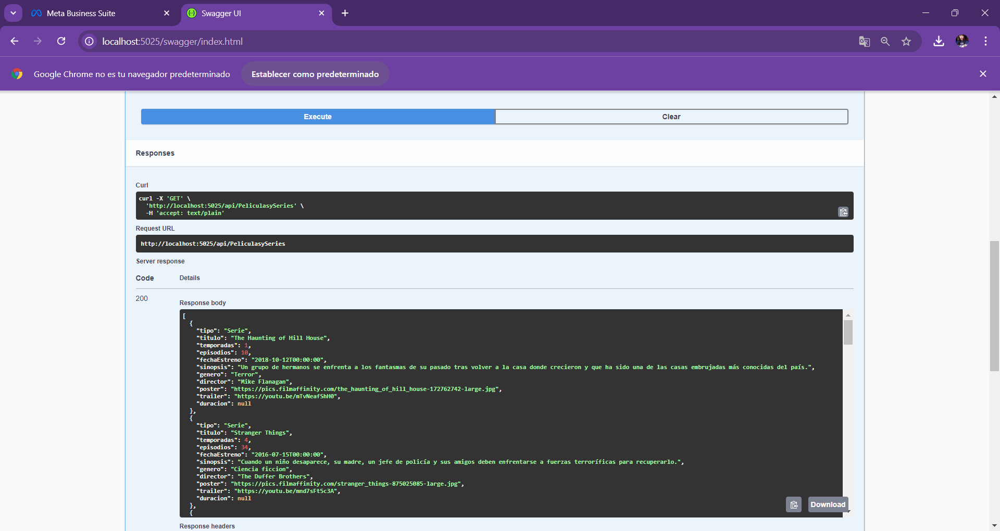

# Funcionamiento del Hub
Al crear un usuarioi si lo guardaba en la base de datos.


Cuando se hacía el registro si lo mandaba nuevamente al login.
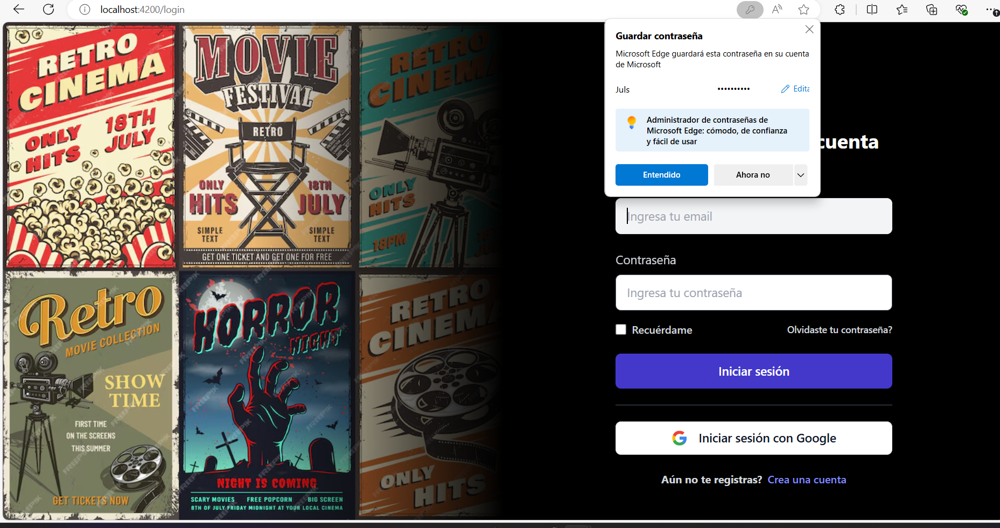

Se pueden ver las peliculas y series.
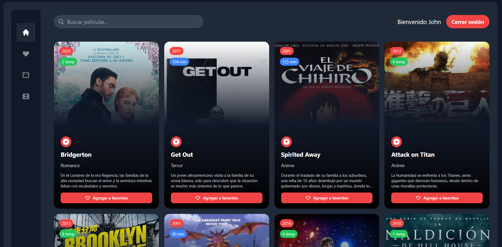

Las peliculas son mostradas.
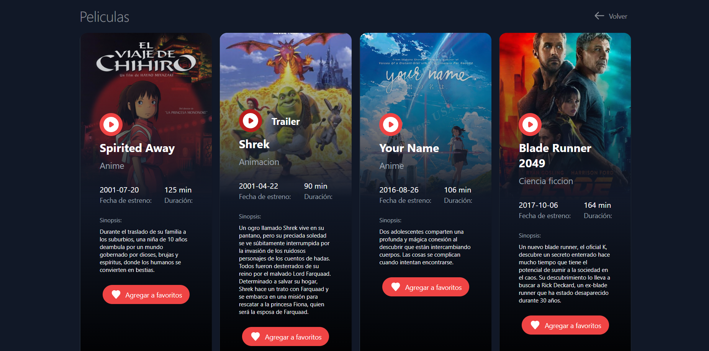

Se pueden visualizar las series tomadas de la BD.
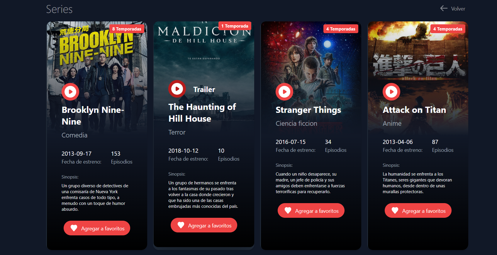

Faltó implementar el funcionamiento de Favoritos.
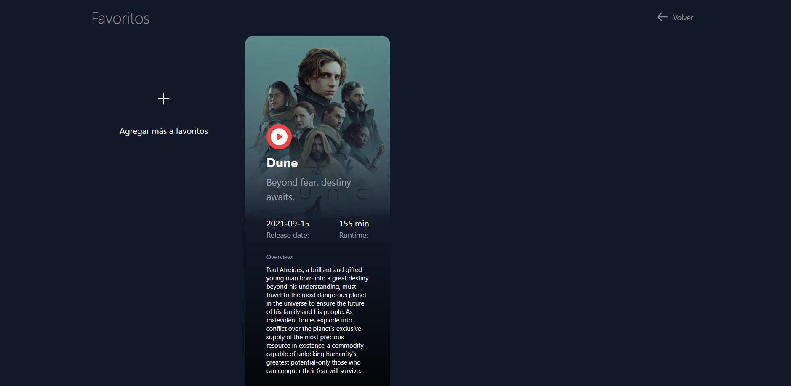

Si atraé los datos del usuario que ingresó y se puede colocar una imagen al gusto como foto de perfil.
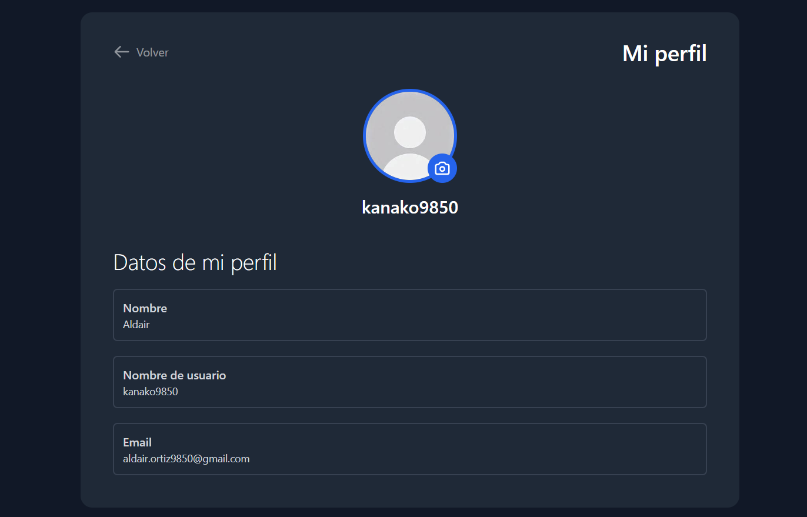

Al momento de cerrar nos regresa al login.
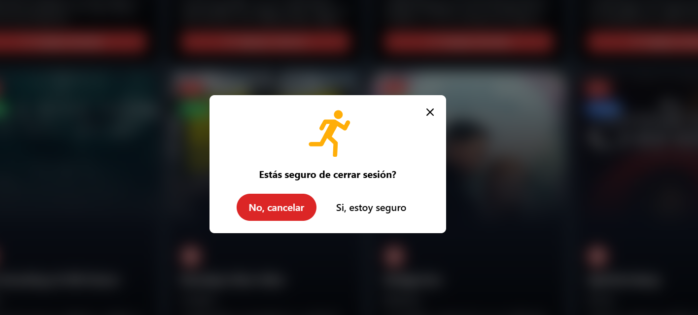

# Posibles mejoras futuras

- Agregar correctamente agregar peliculas y series a favoritos
- Implementar un modal para ver los detalles de la pelicula seleccionada
- Habilitar la funcion del boton recuerdame en el login
- Implementar correctamente la barra de busqueda

# Sprint review

| Aspecto                    | Detalles                                                                                                                                                                                                                                                                                                               |
|--------------------------------|-----------------------------------------------------------------------------------------------------------------------------------------------------------------------------------------------------------------------------------------------------------------------------------------------------------------------------|
| ¿Qué Salió Bien?           | Julieta: Realizar aportaciones que fueron de ayuda para la creación del Front, Backend y Base de datos, en la lluvia de ideas fue esencial para ponernos de acuerdo con lo que se quería lograr, aunque fue poco tiempo para hacer todo lo que los objetivos nos pedían, lo que se logró fue de manera satisfactoria.|
| ¿Qué Puedo Hacer Diferente? | Julieta: No se pudo realizar Docker porque ya cuando iba a concluir la creación de imagen marcaba un error que se estuvo intentando varias veces, por ende, no se concluyó lo de kubernetes.|
| ¿Qué No Salió Bien?        | Julieta: Con un poco más de tiempo tal vez podríamos implementar Docker y Kubernetes. Pero si hablamos de agregar al front sería concluir con lo de Favoritos, que agregue y elimine según el usuario lo desee.|

# Error de docker


# Documentacion de la API


Code coverage 

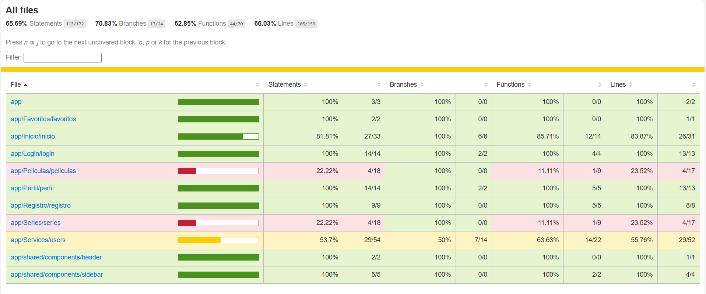
>>>>>>> b37fcbad23d445baad56bf66c81b748c963bbff9

# Contribuyentes al proyecto

| [<br><sub>Montserrat Aguilar Valle</sub>](https://github.com/montsegv-2) | [<br><sub>Carlos Aldair Ortiz</sub>](https://github.com/AldairOrtiz-Kanako) | [<br><sub>K. Julieta Jiménez García</sub>](https://github.com/Julieta171) | [<br><sub>Emmanuel Salcedo</sub>](https://github.com/EmmanuelDev97)
| :---: | :---: | :---: | :---: |


<p align="right">(<a href="#readme-top">Volver al inicio</a>)</p>
